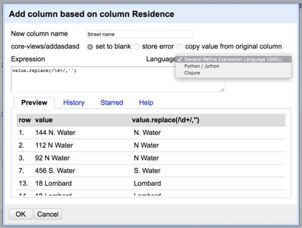

[<<< Previous](tidy-vs-messy-ii.md) | [Next >>>](exporting-data.md)
# Transforming columns

### Splitting columns

If you apply a text facet to **Occupation of females compensation**, notice how many rows include a wage. This is classic messy data, including multiple data types (categorical and discontinuous) under the same variable. One way to begin examining and comparing wages would be to separate those wages into a separate column.

Under **Occupation of females compensation**, select **Edit column** -> **Split into several columns**.

Most commonly, multiple values are separated by a character like a comma. In this case, we see the `$` character.

Replace the comma with a `$` in the **Separator** field. Note we can limit the maximum number of columns -- this could be important in case very very messy data!

Additionally, we'll want to preserve the current column -- so uncheck the **Remove this column** option. Select **OK**.

Now we should have a few new columns. We expect the first new column to be unhelpful -- this column will include text in each cell before the `$` dollar sign. The next column will be our first column of wages. What are the other columns that were created?

Let's delete the first new column by selecting **Edit column** -> **Remove this column**.

Now let's rename the rest of the new columns by selecting **Edit column** -> **Rename this column** to 'Female wages'. Apply a **Text facet** to our first **Female wages** column, what do you notice?

This is a beginning, but you might have noticed that not all the cells with wages under **Occupation of females compensation** included `$` dollar signs. What if we could make sure to select all Arabic numerals, not just for cells that happened to include `$` dollar signs? 

### Challenge

From how many residences on Lombard St. was data collected? Or from any other street? Let's explore one path to answering such a question that makes use of OpenRefine's more advanced features.

Under the **Residence** column, selecting **Text facet** isn't super helpful because it doesn't aggregate different addresses, partly because of address numbers. What if we could strip away address numbers?

Under the **Residence** column, select **Edit column** -> **Add column based on this column...**.

Add a new column name, in this case 'Street name'. For our purposes, we will be using [General Refine Expression Language](https://github.com/OpenRefine/OpenRefine/wiki/GREL-String-Functions) (note the options for Python or Clojure in the dropdown menu). As we enter text in the resulting prompt, we can see results update live. 

Start by entering `value`. Next, let's try to find a particular value -- say the number '144'. We would do this by using the method `find`, as in `value.find('144')`.

How about any number? We can use a commonly used shorthand code called **regular expressions** to match whole classes of characters, in this case Arabic numerals. 

First we need to indicate we are going to use a regular expression instead of normal text. We do this with `/` slashes instead of quotation marks.

The shorthand for one Arabic numeral is `\d`. The shorthand for any number of Arabic numerals together is `\d+`. 

What about '8th' as in 8th Street? In order to save those numerals, we'll want to include a space after. 

This way we will only match on a numeral or a string of numerals followed by a space. So now we have `value.find(/\d+ /)`.

Finally, we wanted to get rid of the numbers, remember? So we'll swap the `.find` method for `.replace`. What should we replace the digits with? Nothing, a blank, which we can indicate with empty quotation marks `''` -- as in `value.replace(/\d+ /, '')`.

Select **OK** and we should have a new column with numbers stripped.

In our new column **Street name**, select **Facet** -> **Text facet**. Next select **count** besides **Sort by**. 

So how many residences surveyed were on Lombard Street? Clearly, this is not perfect. What step might we take to better cluster addresses based on the street?

[<<< Previous](tidy-vs-messy-ii.md) | [Next >>>](exporting-data.md)

